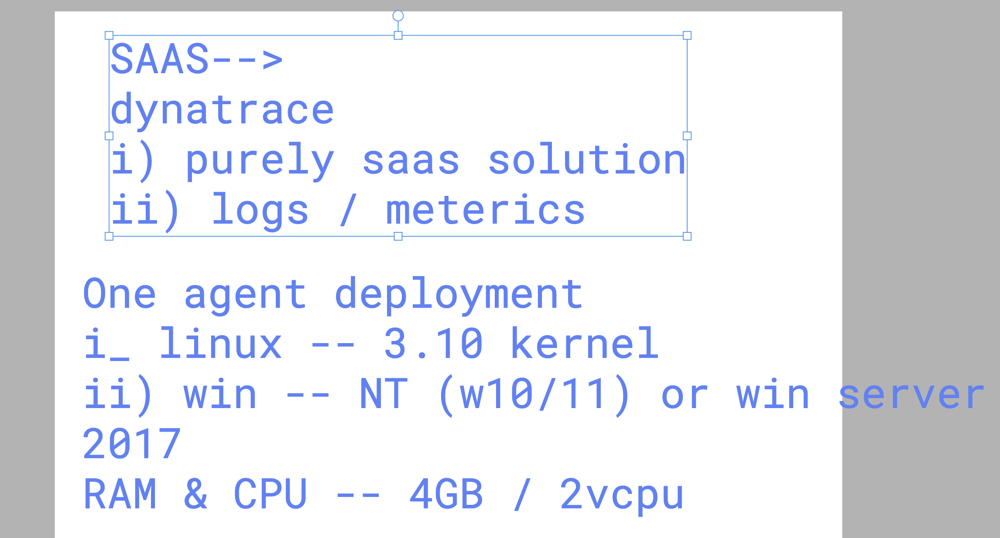

# Mercedes_Dynatrace_21stjuly2025

### Dynatrace things to know for oneagent 



## Deploy Oneagent in LInux platform 

### checking details 

### kernel details 

```
 [root@ip-172-31-2-143 ~]# uname
Linux
[root@ip-172-31-2-143 ~]# uname -r
6.1.141-165.249.amzn2023.x86_64
[root@ip-172-31-2-143 ~]# 

```

### file system 

```
df -hT   /
Filesystem     Type  Size  Used Avail Use% Mounted on
/dev/xvda1     xfs    30G  1.7G   29G   6% /
[root@ip-172-31-2-143 ~]# 

```

### after oneagent setup 

```
root@ip-172-31-2-143 ~]# cd /opt/
[root@ip-172-31-2-143 opt]# ls
aws  dynatrace
[root@ip-172-31-2-143 opt]# cd dynatrace/
[root@ip-172-31-2-143 dynatrace]# ls
oneagent
[root@ip-172-31-2-143 dynatrace]# cd oneagent/
[root@ip-172-31-2-143 oneagent]# ls
agent
[root@ip-172-31-2-143 oneagent]# cd agent/
[root@ip-172-31-2-143 agent]# ls
SELinuxPolicy                authorizedkeys  conf         dt_fips_disabled.flag  installer.version  lib64      rdp  tools
THIRDPARTYLICENSEREADME.txt  bin             datasources  initscripts            lib                libmusl64  res  uninstall.sh
[root@ip-172-31-2-143 agent]# pwd
/opt/dynatrace/oneagent/agent
[root@ip-172-31-2-143 agent]# 

```

### Oneagent location 

```
oot@ip-172-31-2-143 conf]# cd /var/log/dynatrace/
[root@ip-172-31-2-143 dynatrace]# ls
oneagent
[root@ip-172-31-2-143 dynatrace]# cd oneagent/
[root@ip-172-31-2-143 oneagent]# ls
dumpproc  extensions  installer  loganalytics  network  os  plugin  process  sdk  watchdog
[root@ip-172-31-2-143 oneagent]# 


```

### lets monitor sample webapp using  httpd server 

### setup httpd on linux 

```
dnf install httpd -y 

 35  systemctl enable --now httpd
   36  systemctl status httpd
```

### deploy sample ui app to httpd

```
root@ip-172-31-2-143 tmp]# dnf install git -y 
Last metadata expiration check: 0:05:11 ago on Mon Jul 21 07:04:47 2025.
Package git-2.47.1-1.amzn2023.0.3.x86_64 is already installed.
Dependencies resolved.
Nothing to do.
Complete!
[root@ip-172-31-2-143 tmp]# cd /tmp/
[root@ip-172-31-2-143 tmp]# git clone https://github.com/schoolofdevops/html-sample-app.git
Cloning into 'html-sample-app'...
remote: Enumerating objects: 74, done.
remote: Counting objects: 100% (3/3), done.
remote: Compressing objects: 100% (3/3), done.
remote: Total 74 (delta 0), reused 0 (delta 0), pack-reused 71 (from 1)
Receiving objects: 100% (74/74), 1.38 MiB | 37.21 MiB/s, done.
Resolving deltas: 100% (5/5), done.
[root@ip-172-31-2-143 tmp]# 

```
### copy code to specific location 

```
cp -rf /tmp/html-sample-app/*  /var/www/html/
```

## for problem section demo in oneagent  

```
root@ip-172-31-2-143 tmp]# df -h /
Filesystem      Size  Used Avail Use% Mounted on
/dev/xvda1       30G  3.3G   27G  11% /
[root@ip-172-31-2-143 tmp]# fallocate  -l 25G /ashu.txt 
[root@ip-172-31-2-143 tmp]# 
[root@ip-172-31-2-143 tmp]# df -h /
Filesystem      Size  Used Avail Use% Mounted on
/dev/xvda1       30G   29G  1.7G  95% /
[root@ip-172-31-2-143 tmp]# 
[root@ip-172-31-2-143 tmp]# fallocate  -l 1G /ashu1.txt 
[root@ip-172-31-2-143 tmp]# 
[root@ip-172-31-2-143 tmp]# df -h /
Filesystem      Size  Used Avail Use% Mounted on
/dev/xvda1       30G   30G  676M  98% /
[root@ip-172-31-2-143 tmp]# 

```