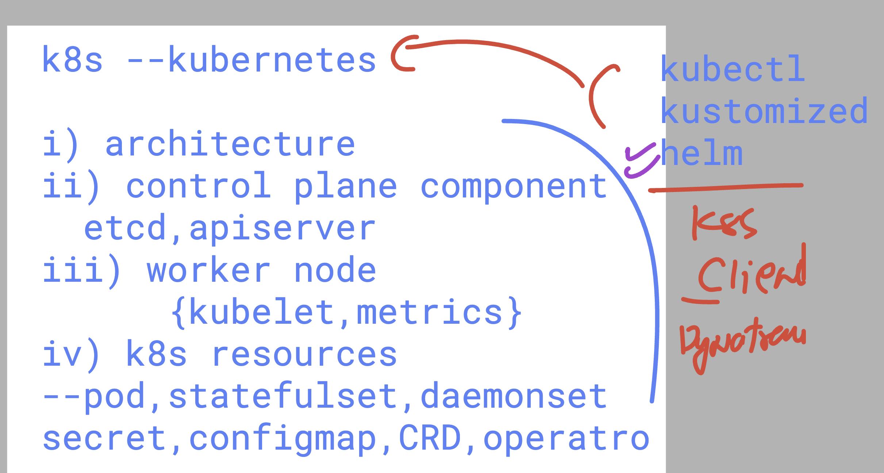

# Mercedes_Dynatrace_21stjuly2025

### setup apache httpd + php + mysql for monolith webapp

```
dnf install php php-mysqli php-json php-fpm  -y 

```


### backend language with any app/web server 

```
[root@ip-172-31-2-143 ~]# dnf install php php-mysqli php-json php-fpm  -y 
Last metadata expiration check: 1 day, 21:15:00 ago on Mon Jul 21 07:04:47 2025.
Package php8.4-8.4.8-1.amzn2023.0.1.x86_64 is already installed.
Package php8.4-mysqlnd-8.4.8-1.amzn2023.0.1.x86_64 is already installed.
Package php8.4-common-8.4.8-1.amzn2023.0.1.x86_64 is already installed.
Package php8.4-fpm-8.4.8-1.amzn2023.0.1.x86_64 is already installed.
Dependencies resolved.
Nothing to do.
Complete!
[root@ip-172-31-2-143 ~]# systemctl reload httpd 
[root@ip-172-31-2-143 ~]# systemctl restart  httpd 
[root@ip-172-31-2-143 ~]# 

```

### creating sample page to test loading 

```
 vim /var/www/html/info.php 
[root@ip-172-31-2-143 ~]# cat /var/www/html/in
index.html  info.php    
[root@ip-172-31-2-143 ~]# cat /var/www/html/info.php 
<?php

phpinfo();
?>
[root@ip-172-31-2-143 ~]# 

```

### to verify 

```
http://ipaddress/info.php

```

## Dynatrace to k8s basic things to know 




### dynatrace to k8s 

# details

### worker nodes -- 2 

```
kubectl  get  nodes 
NAME                                STATUS   ROLES    AGE   VERSION
aks-agentpool-17689719-vmss000000   Ready    <none>   26m   v1.32.5
aks-agentpool-17689719-vmss000001   Ready    <none>   26m   v1.32.5
ashutoshh [ ~ ]$ 


===>

oshh [ ~ ]$ kubectl  get po -A   | grep -i metr
kube-system   ama-metrics-746b7574d4-5qs4v                           2/2     Running   0             24m
kube-system   ama-metrics-746b7574d4-7jb8b                           2/2     Running   0             24m
kube-system   ama-metrics-ksm-bcfdd7489-lq4mw                        1/1     Running   0             24m
kube-system   ama-metrics-node-8wr7f                                 2/2     Running   0             24m
kube-system   ama-metrics-node-jkhhr                                 2/2     Running   0             24m
kube-system   ama-metrics-operator-targets-59bc5d676c-pmgp4          2/2     Running   2 (23m ago)   24m
kube-system   metrics-server-67b9b5c757-4f6ll                        2/2     Running   0             28m
kube-system   metrics-server-67b9b5c757-pzw8p                        2/2     Running   0             28m

### >

ashutoshh [ ~ ]$ kubectl  get --raw  /healthz 
okashutoshh [ ~ ]$ 


```

### dynatrace UI 

```
https://hzq91798.apps.dynatrace.com/
```
