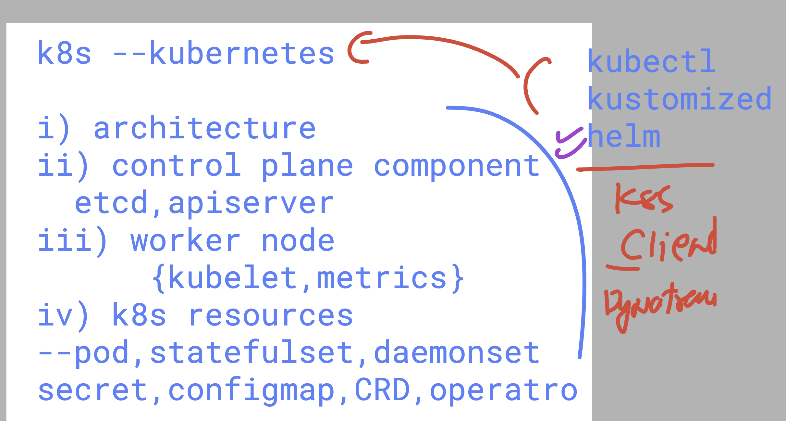

### After Root Password Setup

```bash
mysql -u root -pRedhat@123
```

```
Welcome to the MariaDB monitor.  Commands end with ; or \g.
Your MariaDB connection id is 3
Server version: 10.11.13-MariaDB MariaDB Server

Copyright (c) 2000, 2018, Oracle, MariaDB Corporation Ab and others.

Type 'help;' or '\h' for help. Type '\c' to clear the current input statement.
```

#### Show Databases

```sql
SHOW DATABASES;
```

| Database           |
|--------------------|
| information_schema |
| mysql              |
| performance_schema |
| sys                |

#### Create Dynatrace User

```sql
CREATE USER 'dynatrace'@'%' IDENTIFIED BY 'Redhat@123';
```

#### Check MariaDB Version

```sql
SELECT VERSION();
```

| VERSION()         |
|-------------------|
| 10.11.13-MariaDB  |

#### Grant Permissions

```sql
GRANT SELECT ON performance_schema.* TO 'dynatrace'@'%';
GRANT PROCESS, SHOW DATABASES ON *.* TO 'dynatrace'@'%';
GRANT SELECT ON mysql.slow_log TO 'dynatrace'@'%';
GRANT SELECT ON your_database.* TO 'dynatrace'@'%';
GRANT EXECUTE ON PROCEDURE dynatrace.dynatrace_execution_plan TO 'dynatrace'@'%';
GRANT SELECT ON sys.x$memory_global_by_current_bytes TO 'dynatrace'@'%';
```

#### Verify User Plugin

```sql
SELECT User, Host, plugin FROM mysql.user WHERE User = 'dynatrace';
```

| User      | Host | plugin                |
|-----------|------|----------------------|
| dynatrace | %    | mysql_native_password|

#### Enable Slow Query Log

```sql
SET GLOBAL slow_query_log = 'ON';
SET GLOBAL long_query_time = 2;  -- Sets slow query threshold to 2 seconds
SET GLOBAL log_output = 'TABLE';
```

#### Create Schema and Procedure

```sql
CREATE SCHEMA IF NOT EXISTS dynatrace;

DELIMITER $$
CREATE PROCEDURE dynatrace.dynatrace_execution_plan(IN query TEXT)
    SQL SECURITY DEFINER
BEGIN
    SET @explain := CONCAT('EXPLAIN FORMAT=JSON ', query);
    PREPARE stmt FROM @explain;
    EXECUTE stmt;
    DEALLOCATE PREPARE stmt;
END $$
DELIMITER ;
```

#### Show Performance Schema Status

```sql
SHOW VARIABLES LIKE 'performance_schema';
```

| Variable_name      | Value |
|--------------------|-------|
| performance_schema | OFF   |

---

### Enable Performance Schema

Edit the MariaDB configuration file:

```bash
vim /etc/my.cnf.d/mariadb-server.cnf
```

Add or update the following under `[mysqld]`:

```ini
[mysqld]
datadir=/var/lib/mysql
socket=/var/lib/mysql/mysql.sock
log-error=/var/log/mariadb/mariadb.log
pid-file=/run/mariadb/mariadb.pid
performance_schema=ON
```

### restart mariadb server

```
systemctl restart mariadb
```

## Dynatrace to k8s basic things to know 




### dynatrace to k8s 

# details

### worker nodes -- 2 

```
kubectl  get  nodes 
NAME                                STATUS   ROLES    AGE   VERSION
aks-agentpool-17689719-vmss000000   Ready    <none>   26m   v1.32.5
aks-agentpool-17689719-vmss000001   Ready    <none>   26m   v1.32.5
ashutoshh [ ~ ]$ 


===>

oshh [ ~ ]$ kubectl  get po -A   | grep -i metr
kube-system   ama-metrics-746b7574d4-5qs4v                           2/2     Running   0             24m
kube-system   ama-metrics-746b7574d4-7jb8b                           2/2     Running   0             24m
kube-system   ama-metrics-ksm-bcfdd7489-lq4mw                        1/1     Running   0             24m
kube-system   ama-metrics-node-8wr7f                                 2/2     Running   0             24m
kube-system   ama-metrics-node-jkhhr                                 2/2     Running   0             24m
kube-system   ama-metrics-operator-targets-59bc5d676c-pmgp4          2/2     Running   2 (23m ago)   24m
kube-system   metrics-server-67b9b5c757-4f6ll                        2/2     Running   0             28m
kube-system   metrics-server-67b9b5c757-pzw8p                        2/2     Running   0             28m

### >

ashutoshh [ ~ ]$ kubectl  get --raw  /healthz 
okashutoshh [ ~ ]$ 


```

### dynatrace UI 

```
https://hzq91798.apps.dynatrace.com/
```
