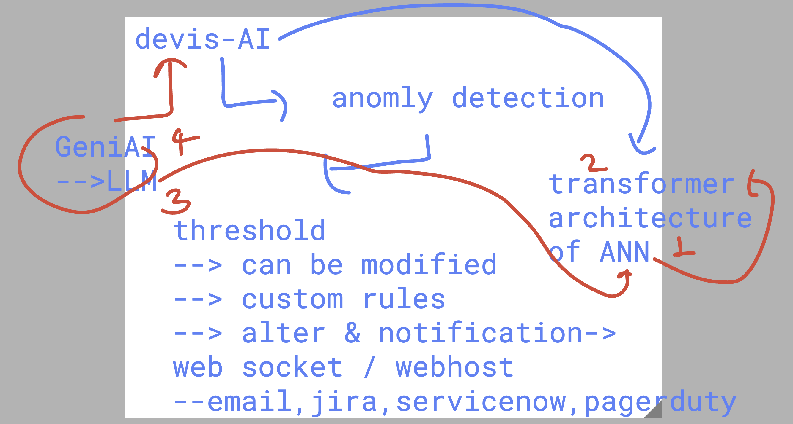
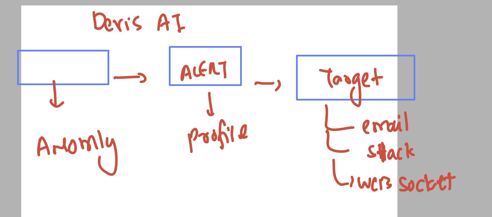

# Mercedes_Dynatrace_21stjuly2025

### info about devis AI 



### devis AI alter system 




### Installing kubectl in your amazon linux 

```
curl -LO "https://dl.k8s.io/release/$(curl -L -s https://dl.k8s.io/release/stable.txt)/bin/linux/amd64/kubectl"

 cp -v kubectl  /usr/bin/
 chmod +x /usr/bin/kubectl 

 kubectl version --client

 ```

 ### kubectl summary 

 ```
 93  kubectl version --client 
   94  history 
   95  ls /tmp/
   96  history 
   97  kubectl  get nodes --kubeconfig /tmp/config 
   98  kubectl version --client 
   99  ls /tmp/config 
  100  ls -l /tmp/config 
  101  history 
  102  kubectl   get nodes  --kubeconfig   /tmp/config 
  103  mkdir -p ~/.kube
  104  cp /tmp/config  ~/.kube/
  105  ls -a
  106  kubectl   get nodes  
  107  kubectl  get ns
  108  kubectl  get all -n dynatrace 
  109  kubectl  get ns
  110  kubectl  create ns ashu-project 
  111  kubectl  get ns
  112  history 
  113  kubectl  config set-context --current --namespace ashu-project 
  114  history 

```

## oneagent to promethes  (collection of data)


### deploy sample app

```
kubectl  create deployment ashu-deploy1 --image nginx --port 80 --replicas 2 
deployment.apps/ashu-deploy1 created
[root@ip-172-31-2-143 ~]# kubectl  get deploy
NAME           READY   UP-TO-DATE   AVAILABLE   AGE
ashu-deploy1   2/2     2            2           37s
[root@ip-172-31-2-143 ~]# kubectl  get pod 
NAME                            READY   STATUS    RESTARTS   AGE
ashu-deploy1-6d89bd8cb4-bznwl   1/1     Running   0          59s
ashu-deploy1-6d89bd8cb4-nqvpl   1/1     Running   0          59s
[root@ip-172-31-2-143 ~]# kubectl  get pod -o wide
NAME                            READY   STATUS    RESTARTS   AGE   IP             NODE                                NOMINATED NODE   READINESS GATES
ashu-deploy1-6d89bd8cb4-bznwl   1/1     Running   0          63s   10.244.1.232   aks-agentpool-17689719-vmss000003   <none>           <none>
ashu-deploy1-6d89bd8cb4-nqvpl   1/1     Running   0          63s   10.244.1.132   aks-agentpool-17689719-vmss000003   <none>           <none>
[root@ip-172-31-2-143 ~]# 

root@ip-172-31-2-143 ~]# kubectl  expose deploy  ashu-deploy1 --type LoadBalancer --port 80 --name ashu-webapp-service
service/ashu-webapp-service exposed
[root@ip-172-31-2-143 ~]# 
[root@ip-172-31-2-143 ~]# 
[root@ip-172-31-2-143 ~]# kubectl  get svc
NAME                  TYPE           CLUSTER-IP     EXTERNAL-IP     PORT(S)        AGE
ashu-webapp-service   LoadBalancer   10.0.238.214   20.242.213.39   80:30846/TCP   24s
[root@ip-172-31-2-143 ~]# 

```
